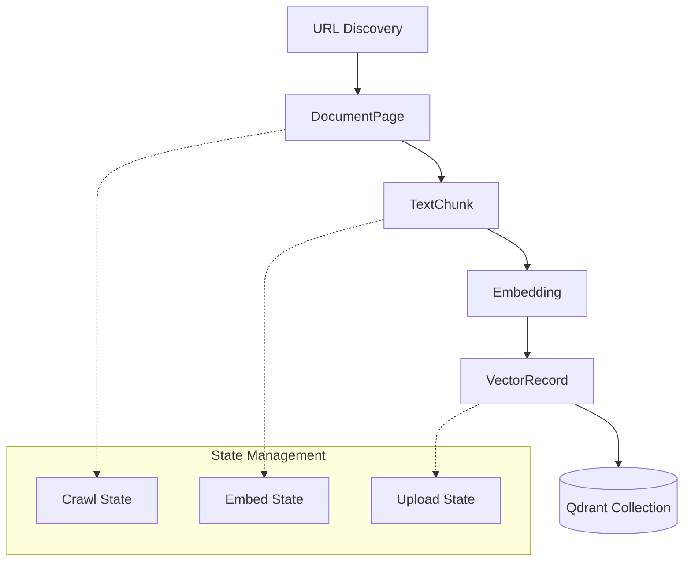

# Data Model: RAG Documentation Embeddings Pipeline

**Feature**: 004-rag-doc-embeddings
**Date**: 2025-12-26
**Purpose**: Define core entities, relationships, and state management for the RAG ingestion pipeline

---

## Entity Overview



---

## 1. DocumentPage

Represents a single page crawled from the Docusaurus site.

### Attributes

| Field | Type | Description | Validation |
|-------|------|-------------|------------|
| `url` | `str` | Full URL of the page | Must be valid HTTP(S) URL |
| `title` | `str` | Page title (from `<h1>` or `<title>`) | Max 500 chars |
| `raw_html` | `str` | Original HTML content | Optional (not persisted by default) |
| `extracted_text` | `str` | Cleaned text content | Required, min 50 chars |
| `crawled_at` | `datetime` | Timestamp of crawl | ISO 8601 format |
| `content_hash` | `str` | SHA-256 hash of extracted text | For change detection |
| `metadata` | `dict` | Additional metadata | Page-specific info |

### Python Implementation

```python
from datetime import datetime
from hashlib import sha256
from pydantic import BaseModel, HttpUrl, Field, validator

class DocumentPage(BaseModel):
    """Represents a crawled documentation page."""

    url: HttpUrl
    title: str = Field(..., max_length=500)
    extracted_text: str = Field(..., min_length=50)
    crawled_at: datetime = Field(default_factory=datetime.utcnow)
    content_hash: str = Field(default="")
    metadata: dict[str, str] = Field(default_factory=dict)

    @validator('content_hash', always=True)
    def compute_hash(cls, v, values):
        """Compute content hash if not provided."""
        if not v and 'extracted_text' in values:
            return sha256(values['extracted_text'].encode()).hexdigest()
        return v

    @validator('metadata')
    def validate_metadata(cls, v):
        """Ensure metadata values are strings."""
        return {k: str(val) for k, val in v.items()}

    def to_cache_file(self) -> tuple[str, dict]:
        """
        Returns content and metadata for caching.

        Returns:
            (text_content, metadata_dict)
        """
        return (
            self.extracted_text,
            {
                'url': str(self.url),
                'title': self.title,
                'crawled_at': self.crawled_at.isoformat(),
                'content_hash': self.content_hash,
                'metadata': self.metadata
            }
        )
```

### Storage Format

Cached as two files:
```
data/cache/extracted/{url_hash}.txt         # extracted_text
data/cache/extracted/{url_hash}.meta.json   # metadata dict
```

---

## 2. TextChunk

Represents a segment of text from a DocumentPage, ready for embedding.

### Attributes

| Field | Type | Description | Validation |
|-------|------|-------------|------------|
| `chunk_id` | `str` | Unique identifier | `{url_hash}_{chunk_index}` |
| `text` | `str` | Chunk content | 50-600 tokens |
| `source_url` | `str` | Original page URL | Required |
| `source_title` | `str` | Original page title | Max 500 chars |
| `chunk_index` | `int` | Position in document | >= 0 |
| `total_chunks` | `int` | Total chunks for document | > 0 |
| `token_count` | `int` | Actual token count | 50-600 |
| `char_start` | `int` | Start position in original text | >= 0 |
| `char_end` | `int` | End position in original text | > char_start |
| `metadata` | `dict` | Additional context | Optional |

### Python Implementation

```python
from pydantic import BaseModel, Field, validator

class TextChunk(BaseModel):
    """Represents a text chunk ready for embedding."""

    chunk_id: str
    text: str = Field(..., min_length=10)
    source_url: str
    source_title: str = Field(..., max_length=500)
    chunk_index: int = Field(..., ge=0)
    total_chunks: int = Field(..., gt=0)
    token_count: int = Field(..., ge=50, le=600)
    char_start: int = Field(..., ge=0)
    char_end: int = Field(..., gt=0)
    metadata: dict[str, str | int | bool] = Field(default_factory=dict)

    @validator('chunk_end')
    def validate_char_range(cls, v, values):
        """Ensure char_end > char_start."""
        if 'char_start' in values and v <= values['char_start']:
            raise ValueError('char_end must be greater than char_start')
        return v

    @validator('chunk_index')
    def validate_index(cls, v, values):
        """Ensure chunk_index < total_chunks."""
        if 'total_chunks' in values and v >= values['total_chunks']:
            raise ValueError('chunk_index must be less than total_chunks')
        return v

    @classmethod
    def from_document(
        cls,
        document: DocumentPage,
        chunks: list[str],
        token_counts: list[int],
        char_positions: list[tuple[int, int]]
    ) -> list['TextChunk']:
        """
        Create TextChunk instances from a document and its chunks.

        Args:
            document: Source document
            chunks: List of text chunks
            token_counts: Token count for each chunk
            char_positions: (start, end) positions for each chunk

        Returns:
            List of TextChunk instances
        """
        url_hash = sha256(str(document.url).encode()).hexdigest()[:16]
        total = len(chunks)

        return [
            cls(
                chunk_id=f"{url_hash}_{i}",
                text=chunk_text,
                source_url=str(document.url),
                source_title=document.title,
                chunk_index=i,
                total_chunks=total,
                token_count=token_counts[i],
                char_start=char_positions[i][0],
                char_end=char_positions[i][1],
                metadata={
                    'doc_type': document.metadata.get('doc_type', 'unknown'),
                    'content_hash': document.content_hash
                }
            )
            for i, chunk_text in enumerate(chunks)
        ]
```

---

## 3. Embedding

Represents a vector embedding generated from a TextChunk.

### Attributes

| Field | Type | Description | Validation |
|-------|------|-------------|------------|
| `chunk_id` | `str` | Reference to TextChunk | Required |
| `vector` | `list[float]` | Embedding vector | Length = 1024 |
| `model` | `str` | Embedding model used | e.g., "embed-english-v3.0" |
| `created_at` | `datetime` | Generation timestamp | ISO 8601 |
| `chunk_ref` | `TextChunk` | Associated chunk | Required |

### Python Implementation

```python
from datetime import datetime
from pydantic import BaseModel, Field, validator

class Embedding(BaseModel):
    """Represents a vector embedding with metadata."""

    chunk_id: str
    vector: list[float] = Field(..., min_length=1024, max_length=1024)
    model: str = Field(default="embed-english-v3.0")
    created_at: datetime = Field(default_factory=datetime.utcnow)
    chunk_ref: TextChunk

    @validator('vector')
    def validate_vector_dimensions(cls, v):
        """Ensure vector has exactly 1024 dimensions."""
        if len(v) != 1024:
            raise ValueError(f'Vector must have 1024 dimensions, got {len(v)}')
        return v

    def to_vector_record(self) -> 'VectorRecord':
        """Convert to VectorRecord for Qdrant storage."""
        return VectorRecord(
            id=self.chunk_id,
            vector=self.vector,
            payload={
                'text': self.chunk_ref.text,
                'url': self.chunk_ref.source_url,
                'title': self.chunk_ref.source_title,
                'chunk_index': self.chunk_ref.chunk_index,
                'total_chunks': self.chunk_ref.total_chunks,
                'token_count': self.chunk_ref.token_count,
                'model': self.model,
                'created_at': self.created_at.isoformat(),
                **self.chunk_ref.metadata
            }
        )
```

---

## 4. VectorRecord

Represents a record stored in Qdrant vector database.

### Attributes

| Field | Type | Description | Validation |
|-------|------|-------------|------------|
| `id` | `str` | Unique vector ID | chunk_id |
| `vector` | `list[float]` | Embedding vector | Length = 1024 |
| `payload` | `dict` | Metadata and text | Required fields |

### Payload Schema

```python
PayloadSchema = {
    # Required fields
    "text": str,              # Original chunk text (for display)
    "url": str,               # Source page URL
    "title": str,             # Page title
    "chunk_index": int,       # Position in document
    "total_chunks": int,      # Total chunks for document
    "token_count": int,       # Chunk size in tokens
    "model": str,             # Embedding model
    "created_at": str,        # ISO timestamp

    # Optional fields
    "doc_type": str,          # e.g., "tutorial", "reference"
    "content_hash": str,      # Document content hash
}
```

### Python Implementation

```python
from pydantic import BaseModel, Field, validator

class VectorRecord(BaseModel):
    """Represents a vector record for Qdrant storage."""

    id: str
    vector: list[float] = Field(..., min_length=1024, max_length=1024)
    payload: dict[str, str | int | bool]

    @validator('payload')
    def validate_payload(cls, v):
        """Ensure required payload fields are present."""
        required_fields = {
            'text', 'url', 'title', 'chunk_index',
            'total_chunks', 'token_count', 'model', 'created_at'
        }
        missing = required_fields - set(v.keys())
        if missing:
            raise ValueError(f'Missing required payload fields: {missing}')
        return v

    def to_qdrant_point(self):
        """Convert to Qdrant Point format."""
        from qdrant_client.models import PointStruct

        return PointStruct(
            id=self.id,
            vector=self.vector,
            payload=self.payload
        )
```

---

## 5. State Management Models

### CrawlState

Tracks crawling progress for resumability.

```python
from pydantic import BaseModel
from datetime import datetime

class CrawlState(BaseModel):
    """Tracks crawling progress."""

    urls_discovered: list[str] = Field(default_factory=list)
    urls_completed: list[str] = Field(default_factory=list)
    urls_failed: dict[str, str] = Field(default_factory=dict)  # url -> error
    last_updated: datetime = Field(default_factory=datetime.utcnow)
    total_pages: int = 0
    completed_pages: int = 0

    def is_completed(self, url: str) -> bool:
        """Check if URL has been crawled."""
        return url in self.urls_completed

    def mark_completed(self, url: str):
        """Mark URL as completed."""
        if url not in self.urls_completed:
            self.urls_completed.append(url)
            self.completed_pages += 1
            self.last_updated = datetime.utcnow()

    def mark_failed(self, url: str, error: str):
        """Mark URL as failed with error message."""
        self.urls_failed[url] = error
        self.last_updated = datetime.utcnow()

    def get_pending_urls(self) -> list[str]:
        """Get URLs that need to be crawled."""
        completed_set = set(self.urls_completed)
        failed_set = set(self.urls_failed.keys())
        return [
            url for url in self.urls_discovered
            if url not in completed_set and url not in failed_set
        ]
```

### EmbedState

Tracks embedding generation progress.

```python
class EmbedState(BaseModel):
    """Tracks embedding generation progress."""

    chunks_processed: list[str] = Field(default_factory=list)  # chunk_ids
    chunks_failed: dict[str, str] = Field(default_factory=dict)  # chunk_id -> error
    last_updated: datetime = Field(default_factory=datetime.utcnow)
    total_chunks: int = 0
    completed_chunks: int = 0
    batch_size: int = 96

    def is_processed(self, chunk_id: str) -> bool:
        """Check if chunk has been embedded."""
        return chunk_id in self.chunks_processed

    def mark_processed(self, chunk_ids: list[str]):
        """Mark chunks as processed (batch)."""
        self.chunks_processed.extend(chunk_ids)
        self.completed_chunks += len(chunk_ids)
        self.last_updated = datetime.utcnow()

    def mark_failed(self, chunk_id: str, error: str):
        """Mark chunk as failed."""
        self.chunks_failed[chunk_id] = error
        self.last_updated = datetime.utcnow()
```

### UploadState

Tracks vector upload progress to Qdrant.

```python
class UploadState(BaseModel):
    """Tracks vector upload progress."""

    vectors_uploaded: list[str] = Field(default_factory=list)  # vector_ids
    vectors_failed: dict[str, str] = Field(default_factory=dict)  # vector_id -> error
    last_updated: datetime = Field(default_factory=datetime.utcnow)
    total_vectors: int = 0
    completed_vectors: int = 0
    batch_size: int = 100

    def is_uploaded(self, vector_id: str) -> bool:
        """Check if vector has been uploaded."""
        return vector_id in self.vectors_uploaded

    def mark_uploaded(self, vector_ids: list[str]):
        """Mark vectors as uploaded (batch)."""
        self.vectors_uploaded.extend(vector_ids)
        self.completed_vectors += len(vector_ids)
        self.last_updated = datetime.utcnow()

    def mark_failed(self, vector_id: str, error: str):
        """Mark vector as failed."""
        self.vectors_failed[vector_id] = error
        self.last_updated = datetime.utcnow()
```

---

## 6. Configuration Model

Centralized configuration with validation.

```python
from pydantic import BaseSettings, Field, validator

class PipelineConfig(BaseSettings):
    """Pipeline configuration from environment and config files."""

    # Docusaurus site
    docusaurus_url: str = "https://ai-robitic-course-hackathon.vercel.app/"
    sitemap_url: str = ""  # Auto-computed from docusaurus_url

    # Cohere settings
    cohere_api_key: str = Field(..., env='COHERE_API_KEY')
    cohere_model: str = "embed-english-v3.0"
    cohere_batch_size: int = 96
    cohere_max_rpm: int = 100

    # Qdrant settings
    qdrant_url: str = Field(..., env='QDRANT_URL')
    qdrant_api_key: str = Field(..., env='QDRANT_API_KEY')
    qdrant_collection: str = "docs-embeddings"

    # Chunking settings
    chunk_size: int = 512
    chunk_overlap: int = 50

    # Concurrency settings
    max_concurrent_requests: int = 5
    request_delay: float = 0.6  # 60s / 100 RPM

    # Storage paths
    data_dir: str = "./data"
    cache_dir: str = "./data/cache"
    state_dir: str = "./data/state"
    log_dir: str = "./data/logs"

    @validator('sitemap_url', always=True)
    def compute_sitemap_url(cls, v, values):
        """Auto-compute sitemap URL if not provided."""
        if not v and 'docusaurus_url' in values:
            base = values['docusaurus_url'].rstrip('/')
            return f"{base}/sitemap.xml"
        return v

    class Config:
        env_file = '.env'
        env_file_encoding = 'utf-8'
```

---

## Entity Relationships

```
DocumentPage (1) ----< (N) TextChunk
TextChunk (1) ----< (1) Embedding
Embedding (1) ----< (1) VectorRecord

CrawlState tracks DocumentPage processing
EmbedState tracks TextChunk -> Embedding processing
UploadState tracks VectorRecord -> Qdrant uploads
```

---

## Data Flow

```
1. Crawl Phase:
   URL Discovery -> DocumentPage -> Cache (text + metadata)
   State: CrawlState (URLs completed/failed)

2. Embed Phase:
   Cache -> TextChunk -> Embedding (via Cohere API)
   State: EmbedState (chunks processed/failed)

3. Upload Phase:
   Embedding -> VectorRecord -> Qdrant Collection
   State: UploadState (vectors uploaded/failed)
```

---

## Storage Schema Summary

| Data Type | Storage Location | Format | Purpose |
|-----------|------------------|--------|---------|
| DocumentPage text | `data/cache/extracted/{hash}.txt` | Plain text | Extracted content |
| DocumentPage metadata | `data/cache/extracted/{hash}.meta.json` | JSON | Crawl metadata |
| CrawlState | `data/state/crawl_state.json` | JSON | Crawl progress |
| EmbedState | `data/state/embed_state.json` | JSON | Embedding progress |
| UploadState | `data/state/upload_state.json` | JSON | Upload progress |
| VectorRecord | Qdrant collection | Binary | Indexed vectors |
| Logs | `data/logs/pipeline_{timestamp}.log` | Text | Structured logs |

---

## Next Steps

- Generate contract specifications (CLI interfaces, config schema)
- Generate quickstart.md with usage examples
- Update agent context with data model details
